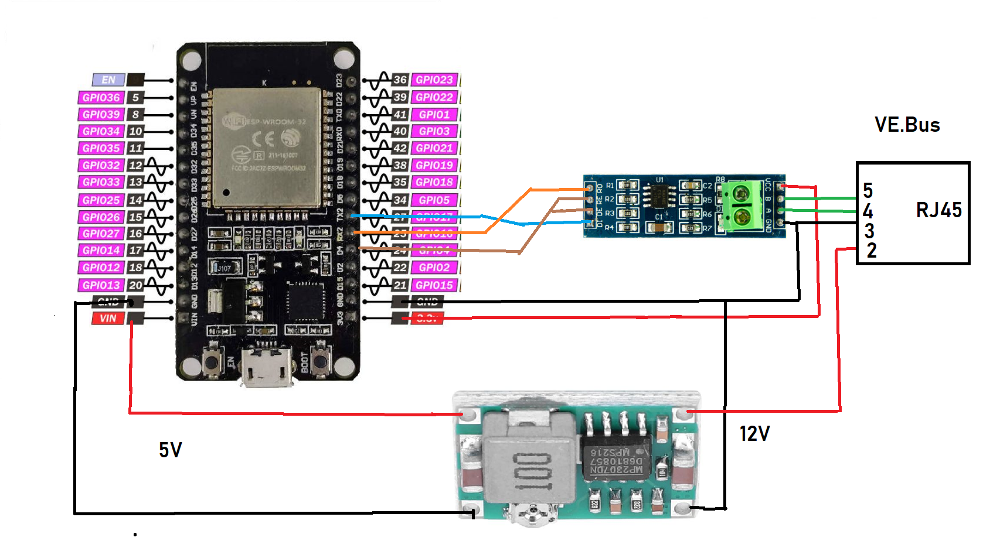
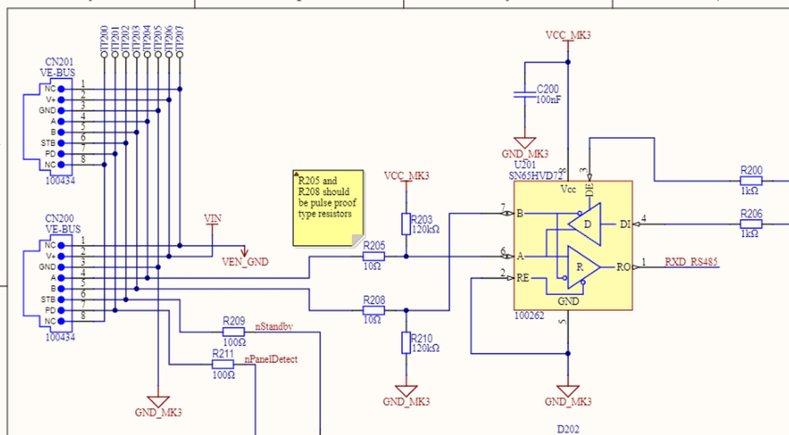
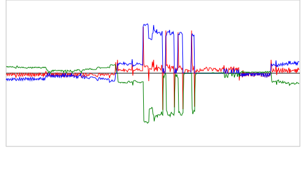
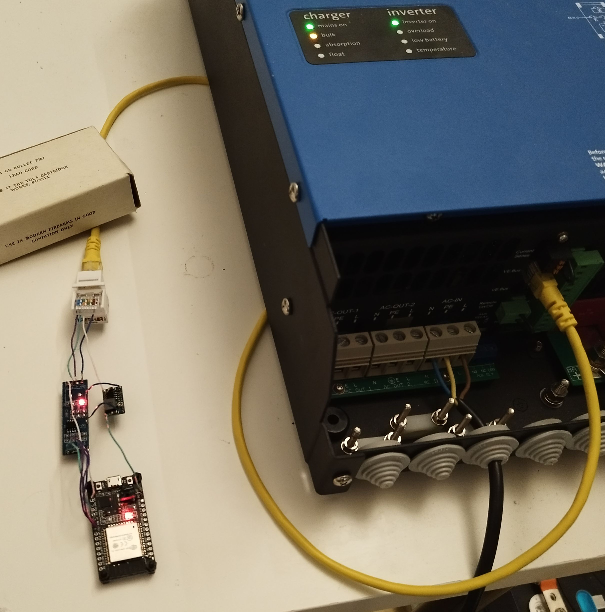
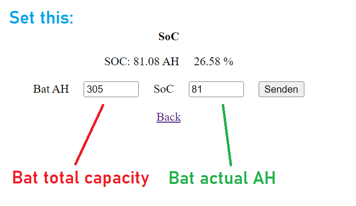

# Shelly2VE.Bus
Victron Multiplus2 VE.Bus connected to Esp32

This is derived from:
https://github.com/pv-baxi/esp32ess

Another similar project:
https://github.com/GitNik1/VEBus

Note you have to set the MPO2 in ESS mode according to PV-Baxi instructions! You will need an mk2 interface for this.
This is "in progress" and i refuse any liability! DO NOT have the multiplus and the esp32 usb connected simultaneously! Program the esp32 alone, detach usb and only then connect to ve.bus.

It implements net-zero with help of a shelly 3EM and a multiplus2 48/3000. Hardware is a esp32 + RS485 converter + 12V to 5V buck converter.

Schematic:

You will have to modify the RS485 converter according to PV-Baxi instructions. Remove the resistors. 
The schematic for the original VE.Bus configuration ist this:

Yes, Vin is not a good place to get power, but it works.

 You have to change the WiFi credentials and the shelly IP:

--

//Wifi password

const char* SSID = "AFD";

const char* PASSWORD = "0101010101";

String Shelly_IP = "192.168.178.47";

--

The esp32 IP adress is dislayed on the serial console at startup.
Uploads can be done with the "upload" button on the esp32 http page. The .bin file is created with arduino ide "Sketch" and "export compiled binary". The "auto" button will try to keep net-power at 25W consumption or -10W in case of PV excess. "charge only" will not generate power / not discharge your battery.

Graph scale ist +1000W top, 0W middle, -1000W bottom. With shelly interval of 5 sec it records the last 40 min.
Red = net power from shelly 3EM, green = power generated or consumed by multiplus2, blue = power command sent to multiplus2.

Mine looks like this:

New version 5.2.24: 
- Sleep / Wakeup of the multiplus2. 
- Low Bat and Hi Bat limits
- configurable target watt
- hysteresis band for charge and invert.

New version 6.2.24: 
- Switching RS485 RX/TX with UART hardware

New version 1.3.24: 
- Autowakeup when PV excess (not really tested)
- Estimated Bat Volt assuming 0.03 ohms internal R

New version 20.4.24:
- Extend graph to +-1850W
- Calculate StateOfCharge. (Set initial value in SoC webpage!)
- Low and High SoC limits.

